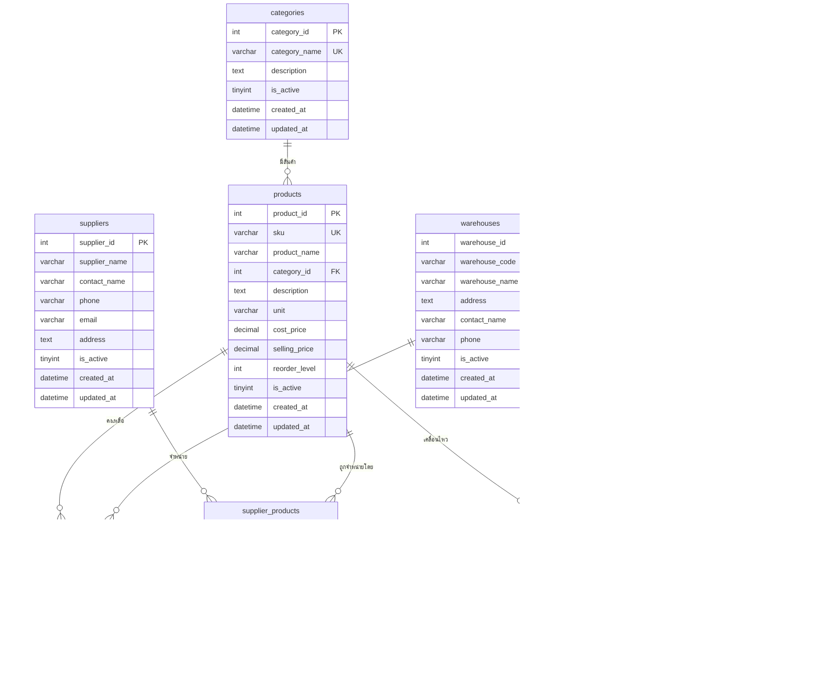

# ER Diagram — inventory_db

```mermaid
erDiagram
    categories ||--o{ products : "มีสินค้า"
    products ||--o{ inventory_balances : "คงเหลือ"
    warehouses ||--o{ inventory_balances : "เก็บสินค้า"
    suppliers ||--o{ supplier_products : "จำหน่าย"
    products ||--o{ supplier_products : "ถูกจำหน่ายโดย"
    products ||--o{ stock_movements : "เคลื่อนไหว"
    warehouses ||--o{ stock_movements : "เกิดที่คลัง"
    users ||--o{ stock_movements : "บันทึกโดย"

    users {
        int user_id PK
        varchar username UK
        varchar password_hash
        varchar full_name
        varchar email UK
        enum role "ADMIN, STAFF"
        tinyint is_active
        datetime created_at
        datetime updated_at
    }
    categories {
        int category_id PK
        varchar category_name UK
        text description
        tinyint is_active
        datetime created_at
        datetime updated_at
    }
    suppliers {
        int supplier_id PK
        varchar supplier_name
        varchar contact_name
        varchar phone
        varchar email
        text address
        tinyint is_active
        datetime created_at
        datetime updated_at
    }
    warehouses {
        int warehouse_id PK
        varchar warehouse_code UK
        varchar warehouse_name
        text address
        varchar contact_name
        varchar phone
        tinyint is_active
        datetime created_at
        datetime updated_at
    }
    products {
        int product_id PK
        varchar sku UK
        varchar product_name
        int category_id FK
        text description
        varchar unit
        decimal cost_price
        decimal selling_price
        int reorder_level
        tinyint is_active
        datetime created_at
        datetime updated_at
    }
    supplier_products {
        int supplier_id PK, FK
        int product_id PK, FK
        varchar supplier_sku
        decimal unit_cost
        int lead_time_days
        tinyint is_preferred
        datetime created_at
    }
    inventory_balances {
        int inventory_id PK
        int product_id FK
        int warehouse_id FK
        int quantity_on_hand
        datetime updated_at
    }
    stock_movements {
        int movement_id PK
        int product_id FK
        int warehouse_id FK
        int user_id FK
        enum movement_type "IN, OUT, ADJUSTMENT"
        int quantity
        varchar reference_no
        text note
        datetime created_at
    }
```

หมายเหตุ: `inventory_balances` มี unique key บนคู่ (`product_id`, `warehouse_id`) จึงมีได้หนึ่งแถวต่อสินค้าหนึ่งชนิดในคลังหนึ่งแห่ง
